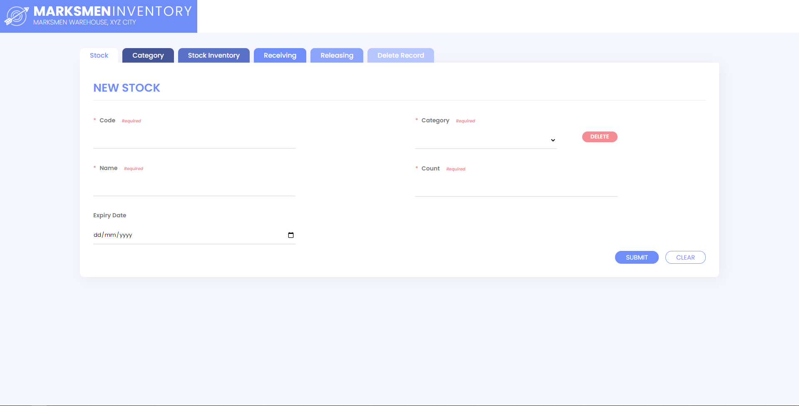

# Marksmen Inventory

<!-- PROJECT LOGO -->
 

  

  <h3 align="center">Marksmen Inventory</h3>

  

    An inventory system that never misses a spot!
     
     
    <a href="https://drive.google.com/file/d/1pyj6oLF54TfkeAM4h4xizIvuUNXYOrNl/view?usp=sharing">View Demo</a>
    ·
    <a href="https://github.com/AlecBlance/MarksmenInventory/issues">Report Bug</a>
    ·
    <a href="https://github.com/AlecBlance/MarksmenInventory/issues">Request Feature</a>
  

 

 

## About
This is a Database Management System 2 Endterm Project. Our instructor provided all the features and form validations. Our goal is to recreate the exact demo project shown to us. We created a modern design and added javascript to employ seamless interaction.

> Note: No security checks were implemented

<!-- LICENSE -->
## License

Distributed under the MIT License. See `LICENSE` for more information.

<!-- CONTACT -->
## Contact

Project Link: [https://github.com/AlecBlance/MarksmenInventory](https://github.com/AlecBlance/MarksmenInventory)

<!-- ACKNOWLEDGEMENTS -->
## Acknowledgements
* [Sir iCE](https://siriceinstructions.wordpress.com/)

## Group Members
* Almira Ruby Montalvo  (`Design and Front-end Development`)
* Michelle Rose Tsoi    (`Design and Front-end Development`)
* Karl Marie Alob       (`Back-end Development`)
* Alec Blance           (`Front-end and Back-end Development`)
* Sean Jasha Dela Cruz  (`Front-end and Back-end Development`)

